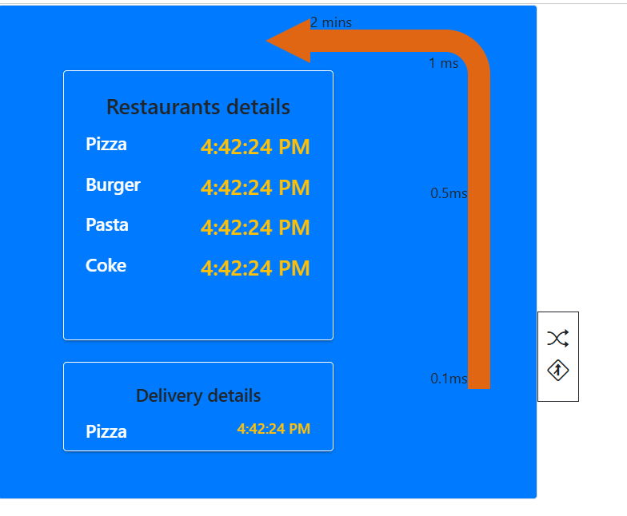

# Angular 16 - Created Drive Thru Restaurant

# Tech stack
- HTML
- SCSS(Positions)
- Bootstrap
- Angular
- Angular CDK(Drag & Drop)

- Deployed into vercel - https://drive-thru-xi.vercel.app/

- We can customize our complete screen based on drag & drop
- We can change the direction of the path based on Shuffle
- Initially single path of Drive thru will display based on selection of two path two directions will display. 
- To save positions based on drag (or) directions (need to implement in feature)

